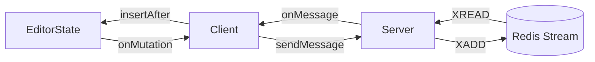

# Lexical Sync Demo (without Yjs)

After reading the article "[Collaborative Text Editing without CRDTs or OT](https://mattweidner.com/2025/05/21/text-without-crdts.html)",
I thought that it's be fun to try to build a collaborative editor without Yjs.

Basically, every local lexical mutation is sent to a redis stream over
websockets and broadcast to all listeners

Here's how it works:

1. Ensure that every node has a (unique) UUID by watching for create mutations.
2. A mapping is (poorly?) maintained between UUIDs and NodeKeys
3. A custom Node Transform is used to (try to) split TextNodes by word (more
   nodes == better sync, probably)
4. Clients connect to a websocket server and receive the current EditorState
   and the stream ID associated with that document.
5. A mutation listener sends websocket messages that contain a serialized node
   and information required to upsert/destroy it. On the server, these messages
   are sent
6. A websocket listener receives messages from other clients and upserts nodes
   from JSON, or destroys them. Node insertion is always relative to a sibling or
   parent.

### Attempt to diagram

## Requirements

- Redis running locally on port 6379

## Running locally

1. In one tab: `npm i && npm run dev`
2. In another tab: `npm run server` (`npm run server-wipe-db` will wipe redis
   if needed).

## Not implemented yet

- Every node type `lexical-yjs` supports (note: I'm actually not sure the best
  way to generically support all node types)
- Accurate server reconciliation (there's no guarantee all clients have the
  same EditorState, we could have an explicit reconciliation cycle or something
  like rollback+reapply per the blog linked above)

## Not planning to implement

- Authentication
- Redis performance magic (seems like you could tell that two websockets are on
  the same ID and share streams but unsure if that matters)

## Why

Probably 60% for fun, 40% because of some things I dislike about Yjs:

- Yjs being a black box feels weird, if collaboration is important I'd like to
  be in control of it
- Persistence is tricky, in general it's easier to just store the binary
  document forever
- Making the server authoritative is also tricky
- Introspecting/modifying the Ydoc in non-JS languages is hard
- The WebRTC integration is broken between browsers (this doesn't solve that,
  but if I have to figure out horizontal scaling and websockets anyway may as
  well go DIY)
- Due to WebRTC being broken, the distributed promises kind of fall apart

## Other thoughts

- It'd be nice if we synced transforms, not mutations, but the word splitting
  might make this less necessary.
- Lexical doesn't really expose the purpose of clone, so it's hard to tell when
  new UUIDs need to be generated (ex: text split/paste vs. just typing)

## Credit

This repository is cloned from `@lexical/react-rich-example`,
`src/Collab` and `server.ts` contain the custom code for this demo.
