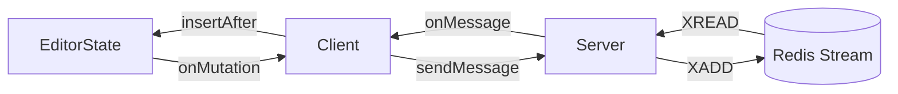

# Lexical Collab Stream

A "taken too far" proof of concept for how you can achieve collaborative text
editing in Lexical by streaming mutations to peers.

## Installation and use

First, install the package:

`npm install --save @mortenson/lexical-collab-stream@latest`

Then in your frontend framework of choice, create a `CollabInstance` and pass
it your Lexical editor:

```js
const collab = new CollabInstance(
  userId, // Some identifier for the user
  editor, // Some instance of the editor
  new CollabWebSocket("wss://example.com"),
  // or
  new CollabTrystero({ appId: "appId", password: "secret" }, "roomId"),
);
collab.start();
```

For ease of use, a React plugin has been included which makes it easier to use
collab stream. Here's an example of adding it to a `LexicalComposer` instance,
and displaying cursors using a provided minimal ugly component:

```jsx
const [cursors, setCursors] = useState();
const [desynced, setDesynced] = useState(false);
return (
  <LexicalComposer>
    <CollaborationPlugin
      userId="userId"
      desyncListener={() => setDesynced(true)}
      cursorListener={(cursors) => setCursors(new Map(cursors))}
      network={{
        type: "websocket",
        url: "wss://example.com",
      }}
    />
    {/* or */}
    <CollaborationPlugin
      ...
      network={{
        type: "trystero",
        config: { appId: "appId", password: "secret" },
        roomId: "roomId",
      }}
    />
    ...
    {desynced && <div>You were offline for too long, oh no!</div>}
    {cursors &&
      Array.from(cursors.entries()).map(([userId, cursor]) => {
        return (
          <CursorElement userId={userId} cursor={cursor} key={userId} />
        );
      })}
  </LexicalComposer>
)
```

If you're using websockets, copy [examples/server/server.ts](examples/server/server.ts)
and modify it as needed for your application. If people are interested I can
add in some amount of default authentication there and make it a more of a
"batteries included" example.

_Note: re-implementing the server in another language is surprisingly simple,
as it mostly exists as a broker for a Redis stream and doesn't require Lexical_

If you're using WebRTC / [Trystero](https://github.com/dmotz/trystero/issues),
no server is required as public signaling servers are used. That said, the
network implementation has less guarantees than websockets and may need some
love when it comes to offline editing.

## Implementation details

After reading the article "[Collaborative Text Editing without CRDTs or OT](https://mattweidner.com/2025/05/21/text-without-crdts.html)",
I thought that it's be fun to try to build a collaborative editor without Yjs.

Here's how it works:

1. Ensure that every node has a (unique) UUID by watching for create mutations.
2. A mapping is (poorly?) maintained between UUIDs and NodeKeys
3. A custom Node Transform is used to (try to) split TextNodes by word (more
   nodes == better sync, probably)
4. Clients connect to a websocket server and receive the current EditorState
   and the stream ID associated with that document.
5. A mutation listener sends websocket messages that contain a serialized node
   and information required to upsert/destroy it. On the server, these messages
   are added to a Redis stream and later streamed back to peers.
6. A websocket listener receives messages from other clients and upserts nodes
   from JSON, or destroys them. Node insertion is always relative to a sibling or
   parent.

### Attempt to diagram



## Running locally

For the websocket server, you'll need Redis running locally on port 6379.

1. Build the library: `npm i && npm run build`
2. In one tab, run the client:
   `cd examples/client && npm i && npm run dev`
3. In another tab:
   `cd examples/server && npm i && npm run server` (`npm run server-wipe-db`
   will wipe Redis if needed).

If you want to try out Trystero/WebRTC instead of running a websocket server,
add the `?trystero` query param to the page.

## Not implemented yet

- Accurate server reconciliation (there's no guarantee all clients have the
  same EditorState, we could have an explicit reconciliation cycle or something
  like rollback+reapply per the blog linked above)

## Not planning to implement

- Authentication
- Redis performance magic (seems like you could tell that two websockets are on
  the same ID and share streams but unsure if that matters)

## Why

Probably 60% for fun, 40% because of some things I dislike about Yjs:

- Yjs being a black box feels weird, if collaboration is important I'd like to
  be in control of it
- Persistence is tricky, in general it's easier to just store the binary
  document forever
- Making the server authoritative is also tricky
- Introspecting/modifying the Ydoc in non-JS languages is hard
- The WebRTC integration is broken between browsers (this doesn't solve that,
  but if I have to figure out horizontal scaling and websockets anyway may as
  well go DIY)
- Due to WebRTC being broken, the distributed promises kind of fall apart

## Other thoughts

- It'd be nice if we synced transforms, not mutations, but the word splitting
  might make this less necessary.
- Lexical doesn't really expose the purpose of clone, so it's hard to tell when
  new UUIDs need to be generated (ex: text split/paste vs. just typing)

## Credit

`examples/client` is cloned from `@lexical/react-rich-example`, the original
LICENSE file is included even though some (minor) modifications have been made.
